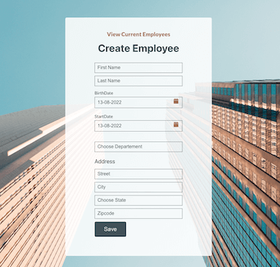
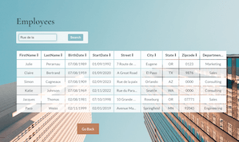

# HealthWealth

## Projet 14 de la formation de developpeur Web Front End Javascript | React

---

Register a new employee:

See the new employee added to the list:

### Tools Used in this project

- React
- Redux Toolkit => Manage the data from the State dispatched in different components of my React App
- NPM => Create, Publish and consume a React composent library
- Lighthouse => audits de performance

#### LANCER LE PROJET

- Clone my [repo](https://github.com/MarieRodiet/wealthhealth.git)
- `cd wealthhealth`
- `npm install`
- `npm run start`
